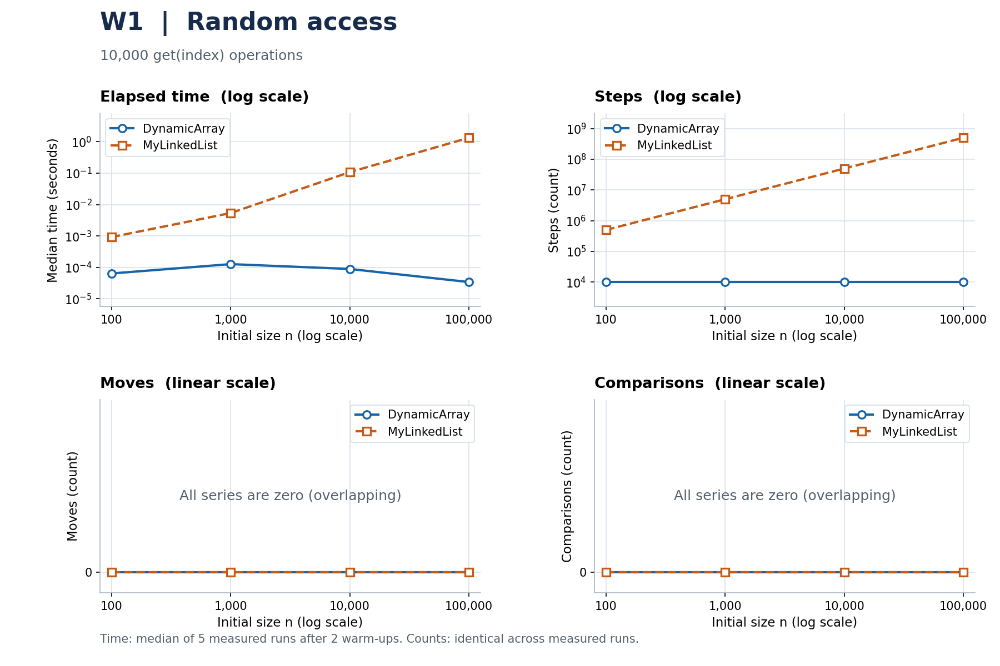
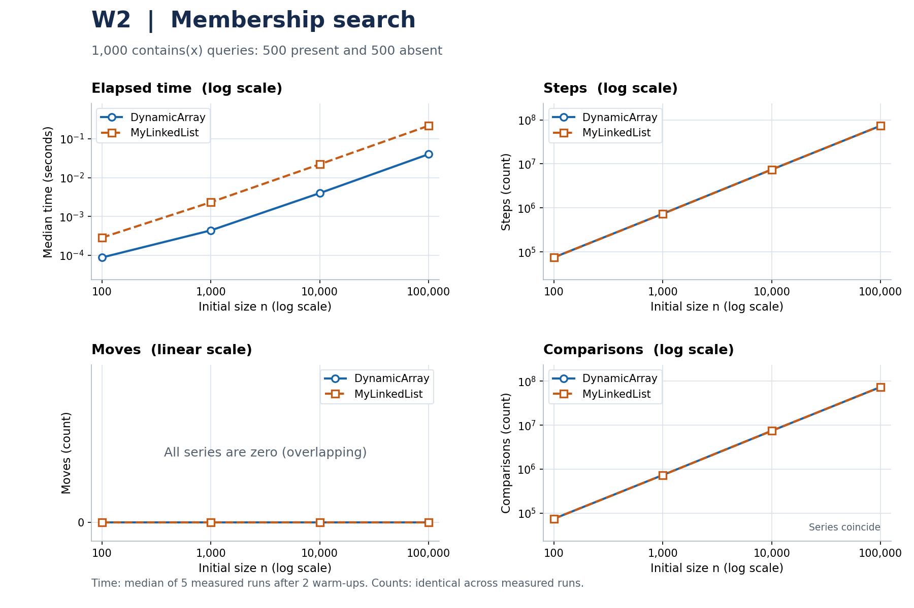
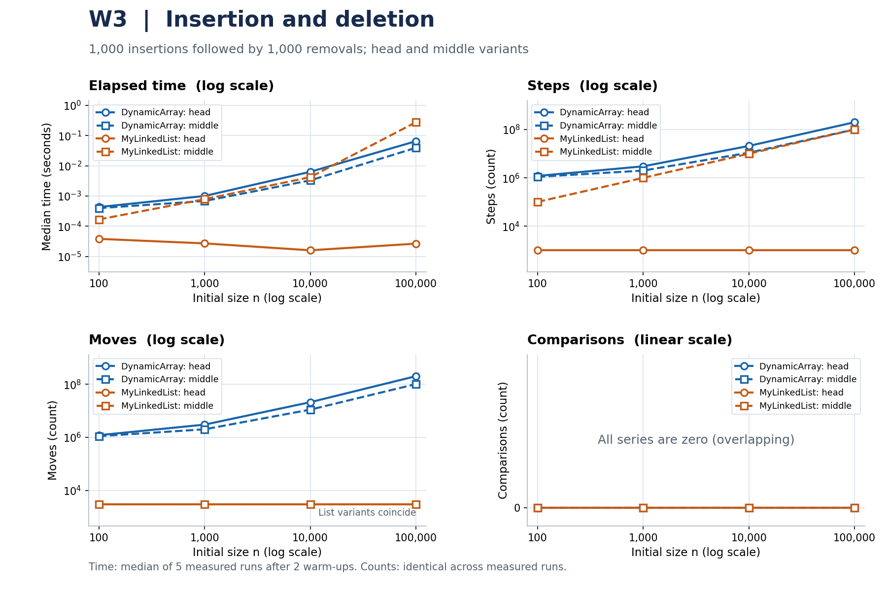
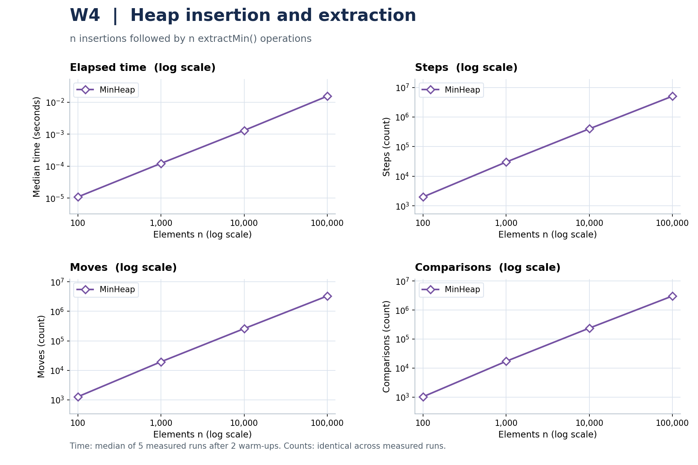

# DAA Assignment 2: Data Structures

## 1. Implementation and measurement

The project implements `DynamicArray`, a singly linked `MyLinkedList` with head
and tail references, and an array-based `MinHeap`. All stored values are primitive
`int`. The two arrays start at capacity 10 and double when full; neither shrinks.
The list uses one `next` reference per node. Standard collections are used only
in tests as reference implementations.

The data below come from [results/results.csv](results/results.csv), measured
with Java 17.0.18 on macOS 26.3.1, aarch64, with eight available processors and a
256 MiB JVM heap. Full settings are in
[benchmark-info.txt](results/benchmark-info.txt). Each size (100, 1,000, 10,000,
100,000) uses `new Random(42)` and the same data and queries for both list
structures. W1 performs 10,000 random reads. W2 performs 1,000 searches, with
exactly 500 present and 500 guaranteed-absent queries, shuffled before timing.
W3 performs all 1,000 insertions before all 1,000 removals, at index 0 or the
fixed original `n / 2`. W4 inserts and extracts all `n` values.

All cases receive two warm-ups before any retained measurements. Five fresh
runs per case then produce the median time. Initial filling for W1-W3 is outside
the timer; W4 includes insertion and extraction. Counters reset before timing
and are copied before validation. Loop bookkeeping and instrumentation are
included, but correctness checks are not. W4 checks nondecreasing order and a
checksum; separate heap tests verify exact values and duplicates.

**Units:** `time_s` is elapsed `System.nanoTime()` divided by `1_000_000_000.0`.
Using seconds instead of the PDF's `time_ms` is the user's explicit deviation.
Each row contains one run's counters, verified equal across all five repeats,
not the sum of five runs.

**Counting rules:** a step is an array-cell read or a `next`-link read, including
`null`; a move relocates an existing array element or assigns a stored list
link; a comparison compares element values. Copying during growth adds one step
and one move per element. A heap swap adds two moves and uses its already-read
values. Initial input writes, local-variable updates, bounds checks, and reading
a node's `int` are excluded. All counts are `long` and are updated inside methods.

## 2. Complexity

Let `n >= 2` be the size before a successful operation, `C` the capacity, and
`p` the probability that an insertion starts with full capacity. Indexed averages
assume uniformly chosen valid indices. Search averages assume uniformly located
first matches and a fixed nonzero hit probability. No distribution over heap
states or incoming keys is assumed, so heap average entries give upper bounds
rather than claiming a tight expected cost. Auxiliary space excludes existing
storage and gives the maximum extra space of one call.

| Structure / operation | Best | Average bound | Worst | Aux. space | Reason |
| --- | --- | --- | --- | --- | --- |
| Array `add(x)` | Θ(1) | Θ(1 + pn) | Θ(n) | Θ(n) | One write when there is room; otherwise copy `n` values. |
| Array `add(i,x)` | Θ(1) | Θ(n) | Θ(n) | Θ(n) | Shift the suffix; a full array also grows. |
| Array `remove(i)` | Θ(1) | Θ(n) | Θ(n) | Θ(1) | Shift `n-i-1` values; last-index removal shifts none. |
| Array `get(i)` | Θ(1) | Θ(1) | Θ(1) | Θ(1) | Read one cell directly. |
| Array `contains(x)` | Θ(1) | Θ(n) | Θ(n) | Θ(1) | Scan through the first match or the whole array. |
| List `add(x)` | Θ(1) | Θ(1) | Θ(1) | Θ(1) | Use `tail` and allocate one node. |
| List `add(i,x)` | Θ(1) | Θ(n) | Θ(n) | Θ(1) | Endpoints are direct; an interior insertion finds its predecessor. |
| List `remove(i)` | Θ(1) | Θ(n) | Θ(n) | Θ(1) | Head removal is direct; other removals find a predecessor. |
| List `get(i)` | Θ(1) | Θ(n) | Θ(n) | Θ(1) | Follow exactly `i` next links from the head. |
| List `contains(x)` | Θ(1) | Θ(n) | Θ(n) | Θ(1) | Follow links until a match or the end. |
| Heap `insert(x)` | Θ(1) | O(log n + pn) | Θ(n) | Θ(n) | Sift up at most one tree height; growth copies `n` values. |
| Heap `peekMin()` | Θ(1) | Θ(1) | Θ(1) | Θ(1) | Read the root. |
| Heap `extractMin()` | Θ(1) | O(log n) | Θ(log n) | Θ(1) | Stop early or sift down one tree height; no shrinking. |

Growth requires Θ(n) extra space only when it occurs; otherwise each operation
uses Θ(1) auxiliary space. Persistent array and heap storage is Θ(C), not always
Θ(n), because deletions keep capacity. List storage is Θ(n+1), including its
constant-size empty state. Invalid-input checks take Θ(1).

**Amortized bounds are separate from averages.** Over `m` appends from empty,
doubling copies `10 + 20 + 40 + ... = O(m)` values in total. Thus array append is
Θ(1) amortized, despite a Θ(n) individual growth. Heap insertion is O(log n)
amortized after adding constant amortized growth cost to sifting; decreasing
inputs can require logarithmic sifting repeatedly. The measured W4 includes
growth, so calling every individual heap insertion Θ(log n) would be incorrect.

## 3. Loop-invariant proofs

### A. `DynamicArray.contains(value)`

The actual loop is in [DynamicArray.java](src/main/java/daa/DynamicArray.java).

1. **Invariant:** Before each iteration, `0 <= i <= size` and no position below
   `i` contains `value`; the stored values and size have not changed.
2. **Initialization:** `i = 0`, so the examined prefix is empty and the statement
   is true.
3. **Maintenance:** The loop reads `elements[i]`. Equality returns `true`
   correctly. Otherwise that element is also not the target, so incrementing
   `i` extends the target-free prefix by one.
4. **Termination:** Each continuing iteration decreases `size - i`. If no match
   returns early, the loop ends at `i = size`, and the invariant covers every
   stored value, so returning `false` is correct.
5. **Conclusion:** The method returns `true` exactly when the target exists,
   including duplicates; an empty array returns `false` immediately.

### B. `MinHeap.siftDown(index)` inside `extractMin()`

The actual loop is in [MinHeap.java](src/main/java/daa/MinHeap.java). Extraction
saves the old root, removes the last occupied position, places its value at the
root if any values remain, and calls `siftDown(0)`.

1. **Invariant:** Every heap edge is ordered except possibly edges leaving
   `index`. If `index` has a parent, that parent's value is no greater than every
   value in the current subtree. Sifting preserves the multiset of retained
   values.
2. **Initialization:** Replacing the root leaves its child subtrees as heaps.
   Only root-to-child edges may be wrong, and the extra parent condition is
   vacuous at the root.
3. **Maintenance:** The code chooses the smaller existing child. If current is
   larger, swapping repairs the old position: the promoted value is no greater
   than either child's root. The parent condition protects the edge above that
   position. The chosen child's old subtree was ordered, so its promoted value
   is no greater than its old descendants or the larger value moved down. Thus
   the parent condition holds at the new `index`, with only its outgoing edges
   possibly wrong. A swap also preserves all retained values.
4. **Termination:** Each swap descends one level in a finite tree. At a leaf,
   there are no outgoing edges to fix. At an early return, current is no greater
   than the smaller child and therefore no greater than either child. Together
   with the invariant, this establishes every heap edge.
5. **Conclusion:** The retained values again form a min-heap. Since the saved
   original root was a minimum, `extractMin()` returns a minimum and preserves
   all other values; singleton extraction needs no loop.

## 4. Measured plots

Each figure contains time, steps, moves, and comparisons against `n`. Time is in
seconds. Sizes use logarithmic axes; count scales preserve zero, and coincident
zero series are labelled. The legends distinguish structures and both W3
variants. These figures use the CSV directly; no theoretical values replace
measurements.

*Figure 1. W1: 10,000 random reads; the array's step count stays at 10,000.*

*Figure 2. W2: both structures make the same number of value comparisons.*

*Figure 3. W3: fixed head and middle positions; array counts include any growth.*

*Figure 4. W4: all insertions and extractions, including heap growth.*

## 5. Discussion

Contiguous `int[]` storage helps sequential search and simple iteration because
a cache line can supply several nearby values. At `n = 100000`, W2 took
0.039998541 s for the array and 0.215896000 s for the list, although both made
73,682,044 value comparisons. The list follows dependent `next` references,
which helps explain why equal Θ(n) bounds can produce different elapsed times.
The results are consistent with cache locality and pointer-chasing costs, but
this experiment does not isolate their individual effects.

Nodes also need object headers and references, while allocation and garbage
collection can add costs beyond storing each `int`. Exact bytes per node were
not measured, because the optional JOL task was not performed. In W1 at
`n = 100000`, the array used 10,000 steps and 0.000034083 s, while the list used
504,930,938 steps and 1.341351250 s. Array indexing is direct, whereas every list
query starts again at the head.

W3 head favoured the list at 0.000026583 s versus 0.065012334 s for the array,
which moved 200,999,000 existing elements. W3 middle favoured the array at
0.039364750 s versus 0.276267917 s, because the list repeatedly had to find a
predecessor even though rewiring its links was cheap. A list therefore fits
head updates and tail appends, while this implementation does not make arbitrary
indexed updates constant time. A heap fits minimum-priority scheduling: W4
processed 100,000 values in 0.015574000 s, with constant-time peek and logarithmic
worst-case extraction.

## 6. Limits and validation

Short cases are sensitive to JVM compilation, GC,
and other system activity; small timing differences and non-monotonic times
should not be treated as changes in asymptotic complexity. The project passed
65 JUnit 5 tests on Java 17. All 36 CSV cases are present, and all five measured
counter triples agree for every case. Reproduction commands are in
[README.md](README.md). Neither optional JOL measurement nor `buildHeap` is included.
